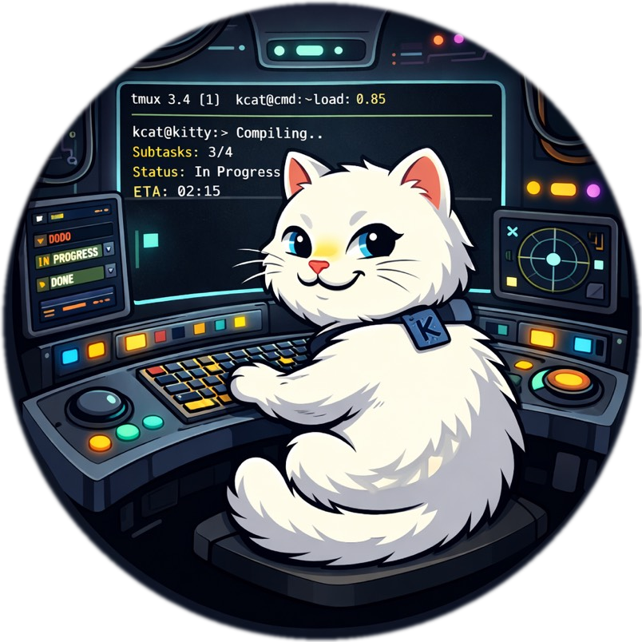

<p align="center">
  
</p>

<h1 align="center">kitty-kommander</h1>

<p align="center"><strong>GPU-rendered terminal cockpit for driving Claude Code Agent Teams.</strong></p>

Kitty terminal + tmux + beads issue tracker + graphviz, wired together into a
four-tab cockpit purpose-built for running Claude Code agent swarms. You get a
tmux canvas for agent teams, a file browser, terminal-native Jupyter notebooks,
and a live dashboard with dependency DAGs and project health — all in one
GPU-accelerated window, themed Tokyo Night end to end.

No Electron. No browser tabs. One terminal, full control.

## What You Get

**Four-tab cockpit layout:**

| Tab | Name | What it does |
|-----|------|--------------|
| 0 | **Cockpit** | tmux session — the agent teams canvas. Panes spawn here as agents work. |
| 1 | **Files** | File browser shell for navigating your project. |
| 2 | **Notebooks** | Jupyter/Go notebooks via [euporie](https://github.com/joouha/euporie), rendered inline with Kitty graphics protocol. |
| 3 | **Dashboard** | Live dependency DAG (graphviz), project health stats, beads issue state. |

**Claude Code skills** — plot, view, cockpit, notebook — installed as symlinked
skill directories. Claude can render matplotlib charts in your terminal, preview
images and PDFs, manage kitty panes, and generate notebooks without leaving the
session.

**ICA cell-leader subagent** — a team leader agent that coordinates up to four
specialist teammates using beads for task tracking and kitty panes for
visibility.

<!-- screenshot here -->

## Prerequisites

| Dependency | What for |
|------------|----------|
| [kitty](https://sw.kovidgoyal.net/kitty/) | GPU-rendered terminal with remote control + graphics protocol |
| [tmux](https://github.com/tmux/tmux) | Pane multiplexing inside the Cockpit tab |
| [beads](https://github.com/beads-dev/beads) (`bd`) | Issue tracking — agents create, claim, and close work items |
| [graphviz](https://graphviz.org/) (`dot`) | Dependency DAG rendering on the dashboard |
| [timg](https://github.com/hzeller/timg) | Image/PDF display via Kitty graphics protocol |
| python3 | Dashboard script, plot skill backend |
| [claude](https://docs.anthropic.com/en/docs/claude-code) | Claude Code CLI — the agents themselves |

## Install

```bash
git clone https://github.com/galeavenworth-personal/kitty-kommander.git
cd kitty-kommander
./install.sh
```

The installer checks dependencies, symlinks kitty/tmux configs into
`~/.config/`, and installs Claude Code skills + the cell-leader subagent into
`~/.claude/`. Existing non-symlink configs are left untouched with a warning.

## Usage

Launch the cockpit:

```bash
# From inside Kitty — press F7, then A
# Or from any shell:
kitty --session ~/.config/kitty/sessions/kommander.kitty-session
```

Tab 0 drops you into a tmux session named `cockpit`. Spawn agent teams here —
each teammate gets a pane. Tabs 1-3 are one keypress away.

## Skills

Skills are Claude Code extensions that give agents terminal-native capabilities.
Installed to `~/.claude/skills/` as symlinks.

| Skill | Trigger | What it does |
|-------|---------|--------------|
| **plot** | "plot this data", "show me a chart" | Data visualization via plotext (fast, terminal-native) or matplotlib with Kitty backend (publication-quality). Also supports gnuplot. |
| **view** | "show me this image", "display the PDF" | Image and document preview via timg. Supports PNG, JPG, GIF, SVG, WebP, PDF. Side-by-side comparison with `--grid`. |
| **cockpit** | "send to pane", "focus tab", "list panes" | Kitty remote control + tmux pane management. Send commands to specific panes, switch tabs, query window state. |
| **notebook** | "create a notebook", "open notebook" | Generate and edit Jupyter notebooks (Go via GoNB, Python). Launch euporie for terminal-native notebook editing with rich output rendering. |

## Cell Leader

The ICA (Intent Cell Architecture) cell-leader is a subagent definition at
`subagents/cell-leader.md`. It implements a small-unit leadership model:

- Receives intent from the driver (you or a parent agent)
- Organizes up to four specialist teammates
- Issues bounded orders with mission, purpose, constraints, and expected output
- Maintains team state and integrates all outputs into one coherent result
- Uses beads for task tracking — every agent gets a tracked work item
- Uses kitty panes for visibility — every agent gets a visible terminal

The cell-leader is not a router. It interprets, plans, delegates, supervises,
and accounts for the outcome.

## Tokyo Night

The entire cockpit is themed [Tokyo Night](https://github.com/folke/tokyonight.nvim).
Kitty colors, tmux status bar, dashboard palette — consistent from the terminal
chrome to the rendered DAGs. One look, zero context switching.

## License

[MIT](LICENSE)
